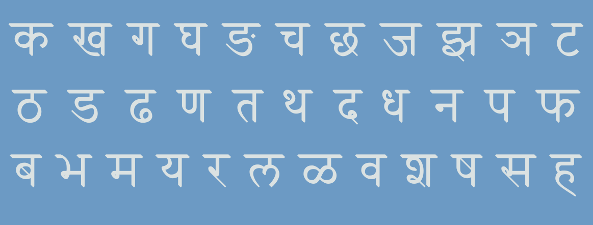

# Recognizing Devanagiri Handwritten Characters Using Convoluted Neural Networks

## Problem Statement
Optical character recognition or optical character reader (OCR) is the electronic or mechanical conversion of images of typed, handwritten or printed text into machine-encoded text, whether from a scanned document, a photo of a document, a scene-photo (for example the text on signs and billboards in a landscape photo) or from subtitle text superimposed on an image (for example from a television broadcast). This project focuses on recognition of handwritten Devanagiri characters. It uses Machine Learning techniques to recognize handwritten characters of alphabets in the Hindi language, which has a very different script from English. I will be using the deep learning Convoluted Neural Network model for this task. The model will be evaluated using the Accuracy score.

## Executive Summary

### Script

The Devanagari script was developed in ancient India from the 1st to the 4th century CE and was in regular use by the 7th century CE. Unlike the Latin alphabet, the script has no concept of letter case(Upper or lower). It is written from left to right, has a strong preference for symmetrical rounded shapes within squared outlines and is recognisable by a horizontal line that runs along the top of full letters.

### Data

The 92000 images of this dataset were generated by imaging the characters written by many individuals resulting in a wide variation in the way each character was written. Each of the dataset images of the characters is unique. The dataset is randomly split into a training set with 85% of the data and a testing set with 15% of the data. The Training Set consists of 78200 images and the training set consists of 13800 images. Each image is 32 x 32 pixels with the actual character centered within 28 x 28 pixels.

### Challenges

The challenges of the model result due to the fact that the dataset consists of many characters that are visually similar or written in a similar way by most people.

### Model and Results

Convolutional Neural Networks (CNN) were developed to make this classification. The model architecture that we used included 4 convolutional layers. The large and deep architecture of Deep CNN with a large bank of trainable parameters make it susceptible to overfitting. While training deep networks, it is very difficult to find optimal hyper parameters of teh functions. We used Dropout layers to prevent our model from overfitting. We were able to achieve 98.2% accuracy by adding two Pooling layers as well as including 2 Dropout layers of 0.25 and 0.5. The model got 312 characters wrong out of 13800 in the testing set. Given the complexity of the characters, we are happy with the results.

## Conclusions and Next Steps
We used the Devanagiri Handwritten Character Dataset which is a publicly available dataset for any researcher. It contains 92000 images of 46 handwritten characters of the script. The challenges in the dataset come from the fact that many characters are visually similar or written in the same way. We ran a CNN model for image recognition. It has 4 Convoluted network layers with two MaxPooling layers to reduce features and avoid overfitting.

Inspite of the characters in the language being so similar and complicted and given the variances in handwritten characters, the model performed very well at 98.3% accuracy. Out of the 13800 test characters (with 300 per class and 46 classes of characters), it misclassified only 312. This shows that Deep CNN models with added Pooling layers and Dropout layers can result in a high test accuracy.

This dataset included 46 characters and did not include the vowels. For the future, this dataset could be extended to include the vowel characters as well. This model could also be extended to other languages like Mandarin or Japanese which have more difficult characterizations. It could also be implemented to design a complete handwritten document digitizing system.
